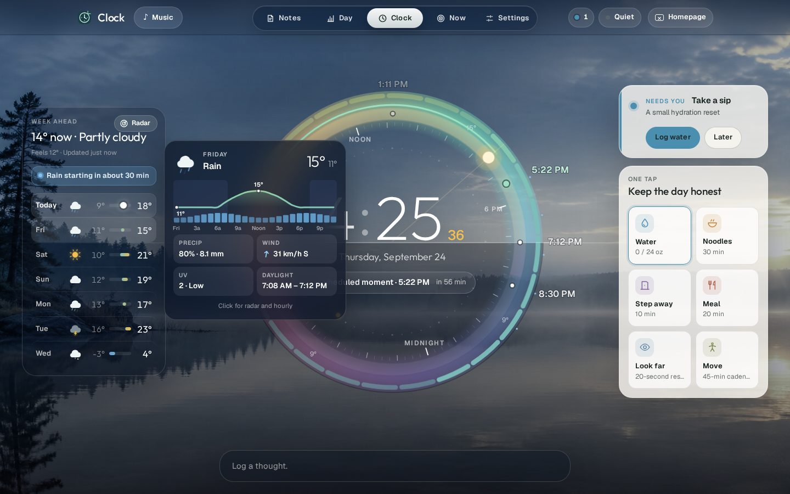
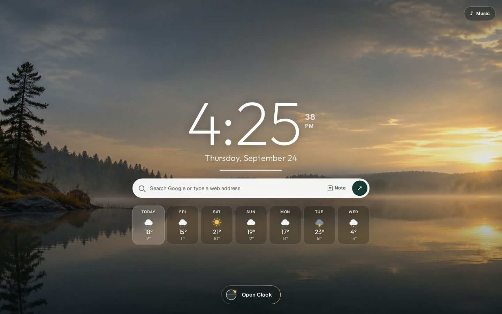
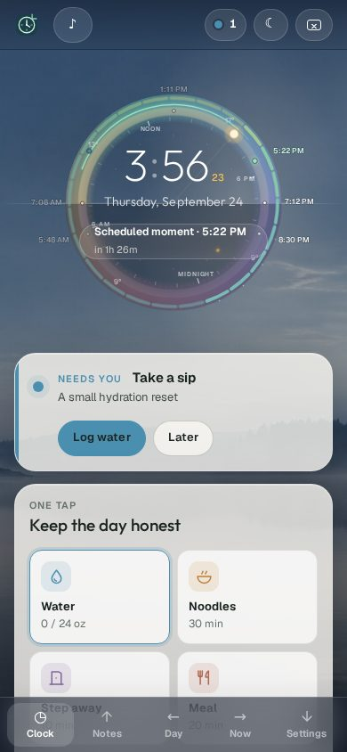

# Pacefold

**Your day, quietly kept.**

Pacefold is a private, local-first workday clock. It keeps time, rhythm, notes, care cues and focus close by, and it doesn't turn your day into a dashboard.

**Open it: https://rbt4.github.io/pacefold/** (installable, works offline, no account)



<table>
<tr>
<td width="68%"></td>
<td width="32%"></td>
</tr>
<tr>
<td align="center"><sub>The start page: a greeting, the day in one line, search, a quick note and the week ahead</sub></td>
<td align="center"><sub>The same Clock on a phone</sub></td>
</tr>
</table>

## What's inside

### The Horizon Dial
- **A 24-hour dial.** Clock shows the whole day on one dial, with solar noon at the top. Sunrise and sunset sit on a level horizon that continues across the screen.
- **The rings.** From the outside in, the dial shows:
  - hourly temperature, with rain marks
  - your workday
  - a daylight band where the sun (or the moon at night) travels and your moments sit
  - quarter-hour ticks
  - a sweeping seconds track around the digital time
- **The panels.** The week ahead sits on the left. The waiting cue and one-tap keys sit on the right. The Daybook composer docks on the horizon.

### A living sky
- **Your daily photo, graded by the sun.** Your daily photo stays behind every screen. It is colour-graded by the real position of the sun, so night, blue hour, golden hour and noon blend continuously.
- **Light that moves.** A horizon glow follows the sun. Stars and faint aurora come out after dusk.
- **The current weather.** Rain, snow, fog and storms show in the sky when they are happening.
- **A seven-day forecast** from Open-Meteo, with no key or account. It shows drawn, animated icons and temperature range bars. Location names never appear.

### Weather you can look into
- **The sky shows it.** Rain (slanted by the wind, with splashes), storms with lightning, snow, fog, cloud shadows, stars and shooting stars at night. Everything parts around your cursor. Try **⌘K → Preview a thunderstorm**.
- **Hover any day** for a card with its hourly temperature curve, chance of rain, wind, UV and daylight. Hover an hour on the dial's temperature ring for that hour.
- **Radar.** In Canada, the same official Environment Canada radar [SkyMap Ontario](https://rbt4.github.io/skymapontario/) uses: the last hour of measured radar, then the official two-hour extrapolation. Elsewhere, RainViewer. In Ontario a **SkyMap** button opens the full 48-hour futurecast. The scope plays the frames around you with a sweeping beam, play/pause and a time scrubber. The map has no labels.
- **The next two hours.** A 15-minute nowcast says when rain or snow starts or stops. When rain is coming, the week panel says so.
- **The full sheet** also has humidity, wind, UV, air quality, sunrise and sunset, and an hourly chart for any of the seven days. Move across the chart to read each hour.

### Getting around
- **Command bar:** ⌘K / Ctrl+K anywhere (or / on Clock) to jump, log, start a session, toggle quiet mode, open the radar or keep a note, without the mouse.
- **Focus view:** press Z or double-click the dial. The panels fall away and the dial fills the sky. Esc returns.
- **The dial explains itself:** hover the sun (or the moon's phase at night), your moments or the workday arc.
- **One switcher**, centred at the top: Notes · Day · **Clock** · Now · Settings, with a thumb that slides to where you are. On a phone it's the tab bar.
- **Keys still fold the app:** ↑ Notes, ← Day, → Now, ↓ Settings, Esc back to Clock. Hovering near an edge never moves you.
- **From the start page**, open Clock with the live mini-dial button, by scrolling down, or by swiping up.

### Design details
- An iridescent aura breathes around the dial and quickens when something needs you.
- Glass panels catch light under the cursor.
- The Daybook dock gets a rainbow edge while you write.
- When Clock opens, the rings draw in.
- Notes, Day log, Now and Settings are frosted glass on the same sky, white in light mode and smoked in dark mode. Appearance can be System, Light or Dark.

### Cues you log instead of dismissing
- **Coloured, quiet cues** for moments, water, prep/noodles, time away, meals, distance looks and movement.
- **Logging resolves a cue.** When you log it, the timer restarts from now. Finished timers close, and scheduled moments are marked kept in the Day log.
- **One tidy stack.** Waiting cues stack on Clock: the top card is ready to log, the rest peek behind it, and **Show all** fans them out. Each card has its own **Log** and **Later** (Later hides just that kind for 15 minutes).
- **It recalculates.** Logging says when the next one is due ("Water logged · next sip around 5:48 PM"). Cards resolved anywhere else, or expired, leave on their own.
- **One system notification.** It has **Log / Later** buttons, works even when Pacefold is closed, and closes itself when you resolve its cue in the app.
- **A live favicon** carries the colours of waiting cues.

### Your day
- **Rhythm.** Prayer times with Hanafi Asr, or everyday, mindful or up to eight custom moments. Privacy modes can keep them discreet (neutral) or hidden.
- **Daybook.** A calendar with quick capture, categories, pin and carry-forward, search and editing.
- **Day log.** Work, focus and break balance, a timeline, and a comparison with the same point yesterday.
- **Now.** Schedule context, waiting cues, active timers and the weather across midnight.
- **Music.** A compact dock for YouTube and YouTube Music links and playlists, plus local **My Music** and focus sounds (Brown hush, Rain glass, Soft fan).
- **Your data stays yours.** JSON backup and restore, an optional live backup file, and an optional OneNote copy. No Pacefold account, analytics or advertising.

Release line: **Pacefold 31.0.0 — Origin**, with the Horizon redesign on top ([CHANGELOG](CHANGELOG.md)).

## Spatial model

- **Clock:** home
- **Up:** Notes
- **Left:** Day log
- **Right:** Now
- **Down:** Settings

Directional movement always comes back through Clock, preserving the original “fold around a clock” idea rather than behaving like a conventional app menu.

## Data continuity is a product requirement

Pacefold intentionally continues to read and write its established local stores, including:

- `pacefoldPrefsV15`
- `pacefold.notebook.entries.v2`
- `pacefold.dayflow.v1`
- durable cue IndexedDB `pacefold-v26`
- live-backup handle IndexedDB `pacefold-v25`

Those historical names are compatibility anchors, not stale code to rename. Existing preferences, notes, logs, timer lineage and backup handles must survive releases.

## Direct-source architecture

The public product lives in `src/`. Production bundles one runtime and one stylesheet; it does **not** reconstruct the old V15–V24 archive/injector stack. Release 31 consolidates the scenic entrance, working Clock and persistent Daybook into one explicit Origin contract.

All styling lives in **one authored stylesheet**, `src/app/pacefold.css`, built from a small set of tokens (paper, ink, forest, cue colours, one type scale, one radius/shadow scale). The historical `src/styles/27-zzzz…` override layers are gone; change the relevant section of that file instead of adding a layer on top. `tests/v31-origin.cjs` fails if the layer directory returns or if `!important` starts creeping back.

```bash
npm install
npm run build        # bundles _site/
npm run verify       # static contracts, no browser needed
npm run preview      # serves _site on :4173
```

### Tests

Six files, all run by CI (`.github/workflows/pages.yml`) before Pages deployment:

| File | Kind | Guards |
| --- | --- | --- |
| `tests/core.mjs` | unit (`npm run verify`) | DST, ordered rhythm, preference/note migration, backup format |
| `tests/music-morphe-r9.cjs` | static (`npm run verify`) | Morphe bridge commands and companion-extension manifest |
| `tests/guided-fold-v28.cjs` | static (`npm run verify`) | Guided Fold wiring, Settings collapsed to Daily / Rhythm / Data |
| `tests/v31-origin.cjs` | static (`npm run verify`) | release identity, continuity stores, single stylesheet (no `src/styles` layers, `!important` ceiling), official-player ad policy |
| `tests/v28-startup-smoke.cjs` | Chromium | cold start, cover → Clock hand-off |
| `tests/v31-origin-browser.cjs` | Chromium, desktop + mobile | cover/Clock geometry, Horizon Dial layout and daily-photo sky, cues that log (one at a time, cold-launch Log, Hidden mode on the dial), weather card on hover, weather sheet with radar frames, nowcast and air quality (mocked, CSP-checked), fold switcher placement and no hover navigation, Music above the cover, neutral-privacy leaks on Clock and Now, water/note/inline-edit persistence, arrow-key folds, first-run setup, mobile tab bar, appearance persistence, Settings pill placement; writes screenshots |

The browser tests need Playwright with Chromium:

```bash
NODE_PATH=/path/to/node_modules node tests/v28-startup-smoke.cjs _site
NODE_PATH=/path/to/node_modules node tests/v31-origin-browser.cjs _site /tmp/pacefold-31-audit
```

Earlier per-release test scripts (V25–V30) were retired in favour of these contracts; they live in Git history.

## Product lineage

The durable ideas from the project’s conception through 31.0 are recorded in [`docs/ORIGIN_TO_FINAL.md`](docs/ORIGIN_TO_FINAL.md). Treat that document as a guardrail when simplifying or redesigning Pacefold.
